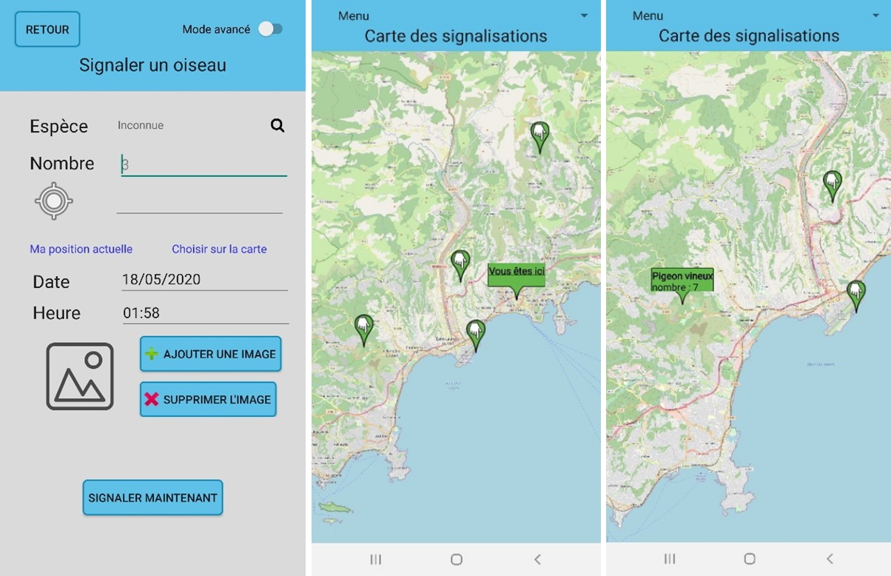

# Birder

Course: Human-machine interfaces

Supervisors: M. Winckler, F. Rallo

Date: April 2020 - May 2020

## Description

Birder is a mobile application for reporting the presence of birds whether you are in the forest, in a park, 
in the mountains or in the city at any time of the day. The application had to be attractive and easy to use in order to 
attract a maximum of people, and ideally, keep them interested. However, it had to offer more advanced options to allow 
professionals to use it in their work. It also had to satisfy all age groups, from children to retirees, and offer them 
solutions adapted to their needs, whether it was to focus them or to make it easier for them to understand how to 
navigate within the application or to motivate them to come back and use the application.

## Authors

- [Io Alfano](https://github.com/IoALFANO)
- [Martin Bouteiller](https://github.com/mbouteiller)
- [João Brilhante](https://github.com/JoaoBrlt)
- [Elise Chamberlin](https://github.com/Elise-Chamberlin)
- [Paul Paillet](https://github.com/PaulPaillet)

## License

This project is licensed under the GPLv3 License - see the [LICENSE](LICENSE) file for details.
